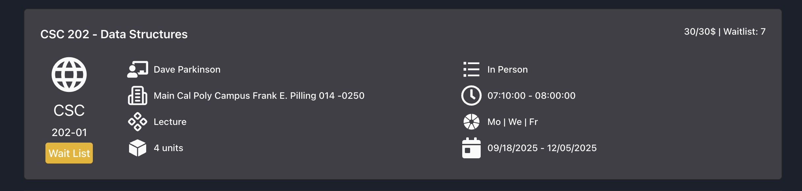
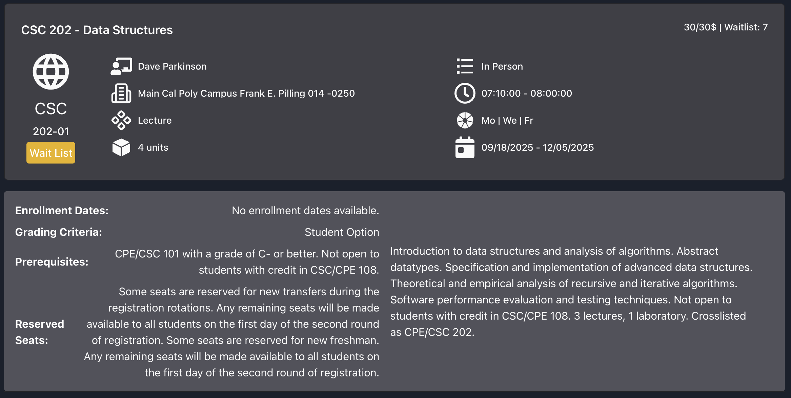

# Search Results

Once the search has completed the results will be displayed in a stacked card format. Each card represents a single course section of that course. Depending on your university lab sections may be listed as separate courses or as part of the main lecture course.

## Course Card Details

### Course Title and Seat Availability

On the top of the card, you will find the course title, and its associated course code. On the right side you will see the current seat availability for that section. If the course is full, the current waitlist length will also be displayed.

### Section Number and Status

On the left side below the course title, you will find the section number and its current status. The status can be one of the following:

- **Open**: The section has available seats for enrollment.
- **Closed**: The section is currently not accepting new enrollments.
- **Waitlist**: The section is full, but you can join the waitlist if drops occur. Please check with your institution for waitlist policies.

### Course Attributes

On the right side of the card you will find key course attributes such as the instructor name \(and their associated rating if available\), number of units, days the course meets, time the course meets, and the instruction mode.

### Viewing More Details

To view more details about a specific course section, click the card. This will expand the card to show additional information such as the course description, prerequisites, and special reserved seats if applicable. Click the card again to collapse it.

## Sorting Results

Use the drop down on the top right of the results page to sort the results by different parameters. You can sort by:

- **Availability**: Sorts courses by the number of available seats in descending order. Prioritizes courses with the most open seats. followed by courses with waitlist.
- **Course Name A-Z**: Sorts courses alphabetically by their course title in ascending order.
- **Course Name Z-A**: Sorts courses alphabetically by their course title in descending order.
- **Course Number**: Sorts courses by their course number in ascending order. This helps in quickly locating specific courses based on their numbering.
- **Instructor Name A-Z**: Sorts courses alphabetically by the instructor's last name in ascending order.
- **Instructor Name Z-A**: Sorts courses alphabetically by the instructor's last name in descending order.
- **Units**: Sorts courses by the number of credit units in ascending order. This is useful for students looking to balance their course load.
- **Time**: Sorts courses by their start time in ascending order. This helps in organizing courses based on their daily schedule
- **Professor Rating**: Sorts courses by the instructor's rating in descending order. If two instructors have the same rating, it will then sort by ranked by number of ratings in descending order.

## Moving Between Pages

If your search returns a large number of results, they will be paginated. By default 20 results will be shown per page. You can navigate between pages using the pagination controls at the bottom of the results list. You can update the number of results per page in Settings.
