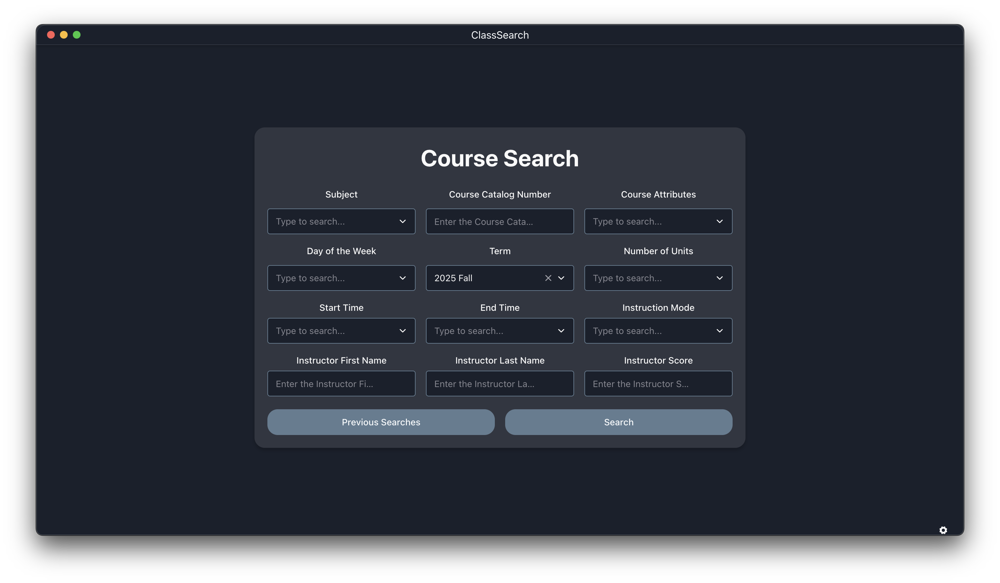

# Usage & Search Parameters

Once the application is installed, you can launch it from your applications menu or desktop shortcut.

## Login

1. On initial launch, you will be prompted to select your university from a dropdown menu. Select your institution and click "Login". Your preferred institution will be saved for future sessions.

2. Afterwards, you will be redirected to your institution's SSO login page. Enter your credentials to log in. If you encounter any issues logging in, please ensure you have selected the correct institution and that your credentials are valid.

> [!NOTE]
> If you run into `401` Access Denied or `403` Forbidden errors, please submit a request to add support for your university. The provided URL most likely invalid from your institution or has been updated since the last update.

3. After logging in, you will be redirected to the primary search portal. You can now search for courses using the provided search fields. Select the parameters you wish to filter by and click "Search".

## Updating Term

Your search term has been auto-inferred from your institution's current term session or registration window. If you wish to change the dropdown
below `Term` and type or select your desired term. Terms can be found either by the term code (e.g : `2252` for Spring 2025) or by the human readable format (e.g : `2025 Spring`).

## Search Parameters

> [!TIP]
> It is recommended to first select a subject before selecting other parameters. This will auto-populate the other fields with valid options based on the selected subject. As of release `v0.3.1`, only `Subject` will trigger auto-population of other fields.

You can find courses using the following parameters:

- **Subject**: The subject area of the course (e.g., "CSC" for Computer Science). Available subjects are auto-populated based on your institution's offerings for that term.
- **Course Number**: The specific course number (e.g.,"CSC 101"). You can enter a full course number or a partial number to find matching courses.
- **Course Attribute**: Specific attributes associated with the course (e.g., "GE Area A1"). Available attributes are auto-populated based on the institution's categorization and offerings for that term.
- **Days of the Week**: Filter courses by the days they are held (e.g., "MWF" for Monday, Wednesday, Friday). You can select multiple days to find courses that meet on any of the selected days.
- **Term**: The academic term for which you want to search for courses (e.g., "2025 Spring"). Refer to the [Updating Term](#updating-term) section above for more details.
- **Number of Units**: Filter courses by the number of credit units they offer (e.g., "4" for a 4-unit course).
- **Start Time**: The time of day the course begins (e.g., "10:00 AM"). If you enter a start time but leave the end time blank, it will filter for courses that start at or after the specified time.
- **End Time**: The time of day the course ends (e.g., "11:00 AM"). If you enter an end time but leave the start time blank, it will filter for courses that end at or before the specified time.
- **Instruction Mode**: The mode of instruction for the course (e.g., "In Person", "Asynchronous"). Available modes are auto-populated based on the institution's offerings for that term.
- **Instructor First Name**: Filter courses by the first name of the instructor (e.g., "John").
- **Instructor Last Name**: Filter courses by the last name of the instructor (e.g., "Doe").
- **Instructor Score**: Filter courses based on the average rating of the instructor from Rate My Professor or PolyRatings. The returned courses will have instructors with a rating equal to or higher than the specified score (e.g., "3.0").
